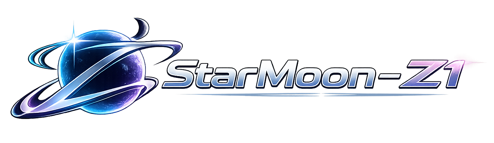

<div align="center">



**小模型训练 · 推理 · 评测一站式框架**

专为 1B ~ 14B 参数语言模型设计 | 目标：用精简核心代码训练最强的小参数代码 / 推理模型

[](https://www.python.org/)
[](https://pytorch.org/)
[](LICENSE)
[](https://developer.nvidia.com/cuda-toolkit)

</div>

---

## 目录

- [项目介绍](#项目介绍)
- [核心特性](#核心特性)
- [架构设计](#架构设计)
- [安装](#安装)
- [快速开始](#快速开始)
- [MSA 长时记忆](#msa-长时记忆)
- [多模态视觉-语言 (VL)](#多模态视觉-语言-vl)
- [三阶段训练](#三阶段训练)
- [评测框架](#评测框架)
- [模型预设](#模型预设)
- [命令行工具](#命令行工具)
- [项目结构](#项目结构)
- [常见问题](#常见问题)

---

## 项目介绍

**StarMoon-z1** 是亦梓科技人工智能部自研的、面向中小规模语言模型（1B ~ 14B 参数）的**一体化训练 / 推理 / 评测框架**。它的定位非常明确：不追求堆参数，而是用一套精炼、可读、可改的核心代码，帮助团队在有限算力下训练出**同等规模下尽可能强**的代码与推理模型，并把它们稳定地部署到生产或端侧环境。

框架以「**完整链路 + 生产级工程 + 长时记忆**」为核心设计原则：

- **完整链路**：覆盖 `预训练 → SFT 指令微调 → DPO 偏好对齐 → 自动评测` 的全流程，无需拼装多个第三方工具。从原始语料到可上线的模型，在同一套配置与 API 下闭环完成。
- **生产级工程**：内置 FlashAttention v2、滑动窗口注意力（支持超长上下文）、AMP 混合精度、torus.compile 图编译、梯度检查点、EMA、早停、断点续训、序列 Packing 等训练加速与稳定性手段，使 28 层深网络也能稳定收敛。
- **长时记忆（MSA）**：原生集成了 MSA（Memory Sparse Attention）文档级稀疏路由机制，让模型在标准 Decoder 之外，具备「离线编码知识库 → 在线按需检索压缩记忆 → 带记忆生成」的能力；`memory_layers=None` 时零开销退化为标准 Decoder，对已有权重与训练脚本**完全无破坏**。

StarMoon-z1 特别适合以下场景：

1. **垂直领域小模型**：在代码、数学、法律、医疗等垂直语料上，用 1B~7B 参数训练出比通用大模型更贴合业务、推理更快、部署更省的专用模型。
2. **资源受限部署**：通过 LoRA、量化、梯度检查点等手段，把训练与推理压到单卡甚至消费级 GPU 可承受的范围。
3. **Agent 长上下文记忆**：借助 MSA 记忆库，让 Agent 在处理长文档、多轮复杂推理时，不必把所有上下文塞进有限窗口，而是按需检索「压缩记忆」。

整个项目以约 2500 行核心代码实现，强调**可读性与可扩展性**——每个模块（模型、注意力、训练器、评测器、推理引擎、记忆引擎）都独立、可单独测试，便于在现有架构上做二次研发（例如扩展多模态视觉-语言能力）。

---

## 核心特性

### 模型架构

- **Decoder-only Transformer**（LLaMA / Qwen 兼容，权重可互相映射）
- **GQA** 分组查询注意力 + **RoPE** 旋转位置编码
- **QK-Norm** 稳定训练 + **Z-loss** 正则化 logits
- **SwiGLU** 门控 FFN + **RMSNorm** 预归一化
- **FlashAttention v2** + **滑动窗口注意力**（支持 256K 上下文）
- **深度缩放初始化** — 深网络（28 层）训练不发散
- **MSA 长时记忆（原生集成）** — 文档级稀疏路由 + 压缩记忆库 + 带记忆生成 / Memory Interleave，`memory_layers=None` 时零开销退化为标准 Decoder
- **多模态 (VL) 原生扩展** — SigLIP-2 视觉塔（冻结）+ Pixel Unshuffle + 2 层 MLP Projector，`vision_tower=None` 时零破坏退化为纯文本 z1

### 训练引擎

- **AMP 混合精度**（bf16 / fp16 + GradScaler）
- **torch.compile** 图编译 + **Fused AdamW** + **TF32** 加速
- **梯度检查点** — 显存降低约 60%
- **EMA** 指数移动平均 + **早停** + **断点续训**
- **序列 Packing** + **动态 Padding** + **指令感知 Label Masking**
- **TensorBoard** 日志 + 吞吐量监控

### 数据管道

- **流式数据集** — TB 级预训练数据无需全量加载
- **领域混合** — 代码 / 数学 / 通用 / 推理按权重采样
- **多轮对话** — 自动构建 assistant-only loss mask

### 评测系统

- **HumanEval**（代码 pass@k）/ **GSM8K**（数学）/ **MMLU**（知识）/ **Perplexity**
- 统一引擎：批量生成 → 答案提取 → 评分 → JSON 报告

---

## 架构设计

```
StarMoonZ1ForCausalLM  ── 标准 Decoder（训练 / 推理 / 评测）
├── StarMoonZ1Model
│   ├── Embedding (可绑定 lm_head)
│   ├── TransformerBlock × N
│   │   ├── RMSNorm → GQA (QK-Norm + RoPE + FlashAttn) → Residual
│   │   └── RMSNorm → SwiGLU FFN → Residual (深度缩放初始化)
│   └── Final RMSNorm
├── LM Head + Z-loss (训练时)
└── 支持: KV Cache / 滑动窗口 / 梯度检查点

StarMoonZ1ForCausalLMWithMemory  ── MSA 长时记忆变体（memory_layers=None 时等价上述）
├── StarMoonZ1MSAModel
│   ├── MemorySparseAttention（记忆层）: qr/kr 路由投影 + 余弦 Top-k 文档路由 + 记忆 KV 拼接
│   └── 其余层为标准 GQA；encode_documents 离线编码压缩记忆库
├── MemoryBank（按层存压缩 K/V/KR + chunk_mask）
└── generate_with_memory / generate_with_interleave

StarMoonY1ForCausalLMWithVision  ── 多模态 (VL) 变体（已在独立包 StarMoonY1 实现，详见 多模态放这里/StarMoonY1/README.md）
```

---

## 安装

```bash
# 克隆项目
git clone https://github.com/yizi-tech/StarMoon.git
cd StarMoon

# 安装
pip install -r requirements.txt
pip install -e .

# 可选加速
pip install flash-attn tensorboard

# 验证
python -c "from StarMoonZ1 import *; print('OK')"
```

**环境要求**：Python ≥ 3.10 | PyTorch ≥ 2.0 | CUDA 11.8+

---

## 快速开始

### 训练

```bash
starmoon-z1 train \
    --model Qwen/Qwen2.5-1.5B-Instruct \
    --data ./data/train.jsonl \
    --output ./output \
    --epochs 3 \
    --batch-size 4 \
    --lr 2e-5
```

### 推理

```bash
# 单次生成
starmoon-z1 infer --model ./output/final --prompt "解释快速排序"

# 交互对话
starmoon-z1 infer --model ./output/final --interactive

# HTTP 服务
starmoon-z1 serve --model ./output/final --port 8000
```

### 评测

```bash
starmoon-z1 eval \
    --model ./output/final \
    --benchmarks humaneval,gsm8k,mmlu \
    --output ./eval_results
```

### Python API

```python
from StarMoonZ1 import StarMoonZ1Config, StarMoonZ1ForCausalLM
from StarMoonZ1.training import SFTTrainer, TrainingArguments, SFTDataset
from StarMoonZ1.evaluation import Evaluator, EvalConfig

# 训练
config = StarMoonZ1Config.preset_1b()
model = StarMoonZ1ForCausalLM(config)
args = TrainingArguments(output_dir="./output", bf16=True, torch_compile=True)
trainer = SFTTrainer(model, args, train_dataset=dataset)
trainer.train()

# 评测
evaluator = Evaluator(EvalConfig(model_path="./output/final", benchmarks=["gsm8k"]))
results = evaluator.run()
```

---

## MSA 长时记忆

在 `StarMoonZ1/msa/` 下**原生实现**了 MSA（Memory Sparse Attention）长时记忆能力，复用现有 `RMSNorm / SwiGLU / apply_rope / GroupedQueryAttention`，对现有权重零破坏。

```python
from StarMoonZ1.msa.model import StarMoonZ1ForCausalLMWithMemory
from StarMoonZ1.model.config import StarMoonZ1Config

cfg = StarMoonZ1Config.preset_7b()
cfg.memory_layers = [16, 18, 20, 22, 24, 26, 28, 30]  # 指定记忆层；设为 None 即标准 Decoder

model = StarMoonZ1ForCausalLMWithMemory(cfg)
# Stage 1: 离线编码文档为压缩记忆库
docs = tokenizer(texts, return_tensors="pt", padding=True)["input_ids"]
memory_bank = model.encode_documents(docs)

# Stage 2/3: 带记忆生成 / Memory Interleave 多轮检索生成
out = model.generate_with_memory(query_ids, memory_bank, max_new_tokens=512)
trace = model.generate_with_interleave(query_ids, memory_bank)  # 返回 (ids, 检索轨迹)
```

命令行（编码语料 → 查询）：

```bash
# 编码 jsonl 语料（{"doc_id","text","metadata"}）为记忆库
python scripts/msa_cli.py encode --model ./output/final --corpus ./docs.jsonl --output ./memory.bin

# 单轮 / Interleave 查询
python scripts/msa_cli.py query --model ./output/final --memory ./memory.bin --prompt "..."
```

> 说明：本机无 GPU 时无法跑实际前向；建议在 GPU 环境补跑 `tests/test_model.py`（含 `TestMSA`）与带记忆生成 smoke test。

---

## 三阶段训练

训练最强小参数代码 / 推理模型的推荐路径：

### Stage 1: 预训练

```python
from StarMoonZ1.training import PreTrainer, PretrainArguments
from StarMoonZ1.data.dataset import DomainMixedDataset

dataset = DomainMixedDataset(
    sources={
        "code":      (code_data, 0.35),   # 代码
        "math":      (math_data, 0.25),   # 数学
        "general":   (general_data, 0.30), # 通用
        "reasoning": (reason_data, 0.10),  # 推理
    },
    tokenizer=tokenizer, max_length=4096,
)

args = PretrainArguments(
    total_tokens=100_000_000_000,  # 100B tokens
    learning_rate=3e-4,
    per_device_train_batch_size=16,
    gradient_accumulation_steps=4,
    torch_compile=True,
    gradient_checkpointing=True,
)
PreTrainer(model, args, train_dataset=dataset).train()
```

> 最后 5% 步自动切换退火阶段（高质量数据 + LR 线性衰减）

### Stage 2: SFT 微调

- 指令感知 masking：仅对 assistant 回复计算 loss
- 序列 packing：短样本拼接，GPU 利用率提升 2~3x

### Stage 3: DPO 对齐

- IPO 损失变体（更稳定，不易过拟合）
- 长度归一化 + Label Smoothing
- Ref Model 显存卸载（节省约 50% 显存）

---

## 评测框架

| Benchmark | 维度 | 指标 | 数据格式 |
|-----------|------|------|----------|
| HumanEval | 代码生成 | pass@1 / pass@10 | JSONL: prompt + test |
| GSM8K | 数学推理 | accuracy | JSONL: question + answer |
| MMLU | 多学科知识 | accuracy | JSONL: question + ABCD |
| Perplexity | 语言建模 | PPL | JSONL: text |

```bash
# 全量评测
starmoon-z1 eval --model ./output/final --benchmarks humaneval,gsm8k,mmlu,perplexity

# 快速验证 (限制样本)
starmoon-z1 eval --model ./output/final --benchmarks gsm8k --max-samples 50
```

结果输出为 `eval_results/eval_report.json`，支持跨实验对比。

---

## 模型预设

| 预设 | 参数量 | Layers | Hidden | KV Heads | FFN | 上下文 |
|:----:|:------:|:------:|:------:|:--------:|:---:|:------:|
| **1b** | ~1.5B | 28 | 2048 | 4 | 6144 | 32K |
| 3b | ~2.8B | 26 | 3200 | 8 | 8640 | 32K |
| 7b | ~6.7B | 32 | 4096 | 8 | 11008 | 64K |
| 14b | ~12.7B | 40 | 5120 | 10 | 13824 | 64K |

> **1B 预设设计思路**：更深（28 层）强化推理 | 更强 GQA（4 KV 头）省参数 | 绑定 embedding 释放 310M 参数给 Transformer 层

---

## 命令行工具

```
starmoon-z1 train      SFT/LoRA 训练
starmoon-z1 infer      推理 (单次 / 交互 / chat)
starmoon-z1 serve      启动 HTTP 推理服务
starmoon-z1 eval       评测 benchmark
starmoon-z1 quantize   模型量化 (FP16/BF16)
starmoon-z1 info       查看预设配置
```

<details>
<summary><b>eval 参数详情</b></summary>

| 参数 | 默认值 | 说明 |
|------|--------|------|
| `--model` | 必填 | 模型路径 |
| `--benchmarks` | `gsm8k` | 逗号分隔: humaneval,gsm8k,mmlu,perplexity |
| `--data-dir` | None | 自定义数据目录 |
| `--output` | `./eval_results` | 报告输出目录 |
| `--max-new-tokens` | 512 | 最大生成长度 |
| `--temperature` | 0.0 | 采样温度 (0=greedy) |
| `--max-samples` | None | 限制样本数 |

</details>

<details>
<summary><b>train 参数详情</b></summary>

| 参数 | 默认值 | 说明 |
|------|--------|------|
| `--model` | 必填 | 模型路径或 HF ID |
| `--data` | 必填 | 训练数据 (JSONL) |
| `--output` | `./output` | 输出目录 |
| `--epochs` | 3 | 训练轮数 |
| `--batch-size` | 4 | 批次大小 |
| `--lr` | 2e-5 | 学习率 |
| `--max-length` | 2048 | 最大序列长度 |
| `--lora-r` | 8 | LoRA 秩 |
| `--full-finetune` | False | 全量微调 (否则 LoRA) |
| `--bf16` | True | BF16 混合精度 |

</details>

---

## 项目结构

```
StarMoon-z1/
├── StarMoonZ1/
│   ├── cli.py                  # CLI (train/infer/serve/eval/quantize/info)
│   ├── model/
│   │   ├── config.py           # 配置 + 预设 (QK-Norm, Z-loss, 滑动窗口, MSA 字段)
│   │   ├── model.py            # Transformer (GQA, RoPE, FlashAttn)
│   │   └── lora.py             # LoRA 适配器
│   ├── msa/
│   │   ├── memory_bank.py      # MemoryBank / MemoryLayerBank + 持久化
│   │   ├── rope.py             # DocumentRoPEHelper (Parallel/Global 双模式)
│   │   ├── layers.py           # MemorySparseAttention / ChunkMeanPooler / MSABlock
│   │   ├── model.py            # StarMoonZ1MSAModel / StarMoonZ1ForCausalLMWithMemory
│   │   └── engine.py           # MSAEngine (编码/查询/增量更新)
│   ├── vl/                     # ⚠️ 已迁出：多模态代码整体移至仓库根「多模态放这里/StarMoonY1/」（StarMoon-y1 独立包）
│   ├── scripts/
│   │   ├── msa_cli.py          # MSA 命令行入口 (encode / query)
│   │   └── vl_cli.py           # 多模态命令行入口 (ask / encode)
│   ├── training/
│   │   ├── trainer.py          # 基类 (AMP, EMA, 早停, 续训, TensorBoard)
│   │   ├── pretrain.py         # 预训练 (多阶段, 退火, 流式)
│   │   ├── sft.py              # SFT (masking, packing, 动态padding)
│   │   └── dpo.py              # DPO (IPO, 长度归一化, ref卸载)
│   ├── evaluation/
│   │   ├── evaluator.py        # 评测引擎
│   │   ├── benchmarks.py       # HumanEval / GSM8K / MMLU / PPL
│   │   └── metrics.py          # pass@k, EM, F1
│   ├── inference/
│   │   └── engine.py           # 多后端推理 + HTTP 服务
│   ├── data/
│   │   └── dataset.py          # 流式 / 领域混合 / 对话模板
│   └── utils/
│       └── distributed.py      # DDP 分布式
├── 多模态放这里/
│   └── StarMoonY1/             # 多模态独立包（StarMoon-y1，与 StarMoonZ1 基座分离）
│       ├── vision_tower.py     # VisionTower (SigLIP-2, 冻结, 惰性加载)
│       ├── projector.py        # MultiModalProjector (Pixel Unshuffle + 2 层 MLP)
│       ├── model.py            # StarMoonY1ForCausalLMWithVision (encode/generate)
│       ├── processor.py        # StarMoonY1VLProcessor (<image> 展开 + pixel_values)
│       ├── collator.py         # VLCollator (批处理)
│       └── __init__.py         # 导出 StarMoonY1ForCausalLM 别名 (HuggingFace architectures)
├── tests/
│   └── test_model.py
├── setup.py
└── requirements.txt
```

---

## 常见问题

<details>
<summary><b>训练显存不够？</b></summary>

依次启用：
1. `gradient_checkpointing=True` (显存 -60%)
2. `bf16=True` (显存减半)
3. LoRA 微调 (仅训练约 1% 参数)
4. 减小 batch_size + 增大 gradient_accumulation_steps

</details>

<details>
<summary><b>如何扩展上下文到 256K？</b></summary>

```python
config = StarMoonZ1Config.preset_7b()
config.max_position_embeddings = 262144
config.sliding_window = 4096  # 滑动窗口降低 KV Cache 显存
```

需配合 FlashAttention 使用（避免 O(T²) 掩码内存）。

</details>

<details>
<summary><b>兼容哪些 HuggingFace 模型？</b></summary>

LLaMA / Qwen / Mistral / Yi 等标准 Decoder-only 架构。使用 `StarMoonZ1ForCausalLM.from_pretrained("model-id")` 自动映射权重。

</details>

<details>
<summary><b>如何添加新 Benchmark？</b></summary>

继承 `Benchmark` 基类，实现三个方法：

```python
from StarMoonZ1.evaluation.benchmarks import Benchmark, BENCHMARK_REGISTRY

class MyBenchmark(Benchmark):
    name = "my_bench"
    metric_name = "accuracy"

    def load_data(self, data_path=None): ...
    def build_prompt(self, sample): ...
    def score(self, sample, generation): ...

BENCHMARK_REGISTRY["my_bench"] = MyBenchmark
```

</details>

---

## 许可证

[Apache 2.0](LICENSE)

---

<div align="center">

**StarMoon-z1** © 2025 亦梓科技

</div>
